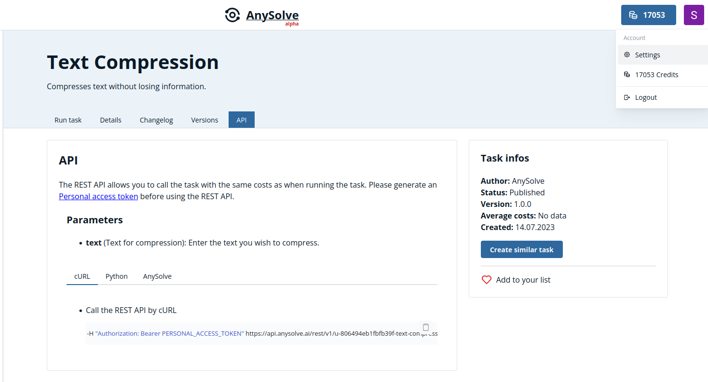
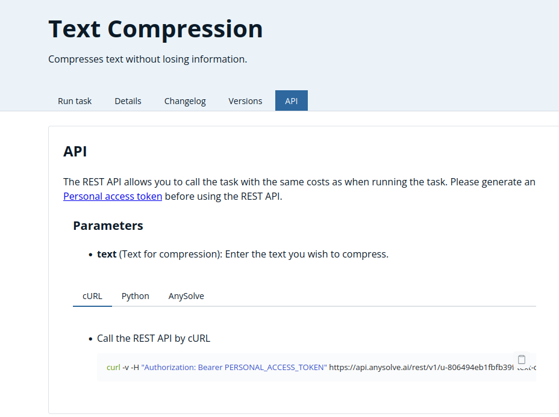

# API for AI tools

AnySolve allows you to streamline the execution of AI tasks by bundling steps into AnySolve tasks. This enables the creation of customized tasks for solving specific AI problems with adjustable parameters.

Every task on AnySolve, such as the [Text Compression](https://www.anysolve.ai/tasks/u-806494eb1fbfb39f-text-compression?version=1.0.0) task, is accessible via a RESTful interface.

If you're looking to exclusively use OpenAI's **ChatGPT** with our REST Interface you can use the [ChatComplete (GPT and others)](https://www.anysolve.ai/tasks/intern-gpt-chat-completion) task. Additionally, **GPT** without Chat capabilities is accessible through the [Completion (GPT and others)](https://www.anysolve.ai/tasks/intern-gpt-completion) task.

## Introduction Video

To kick things off, watch our informative introduction video that provides an insightful overview of the API functionalities.

{: poster='../ai-api.jpg'}

## Costs

The execution of tasks by the REST interface costs as much as when running a task [manually](https://www.anysolve.ai/pricing).

## Personal Access Token

Before utilizing the REST API, you must create a personal access token, which serves as your authentication credential. To do so, navigate to the settings section by clicking on `Settings` in the top-right corner of the page.

Next, access the `Personal Access Tokens' tab and assign a name to your new access token, such as 'local-dev'.

After clicking `Save`, the system generates a token. Make sure to copy it, as it won't be displayed again.

## Using the REST API

Every task, like [Text Compression](https://www.anysolve.ai/tasks/u-806494eb1fbfb39f-text-compression?version=1.0.0) or [ChatComplete (GPT and others)](https://www.anysolve.ai/tasks/intern-gpt-chat-completion), contains an `API` section that provides instructions on utilizing the task.

You have two main options for using the REST API:

- Use the REST API directly by a tool, e.g. cURL.
- Use the Python library [anysolve](https://github.com/BlackriverOrg/anysolve) to execute a task.
