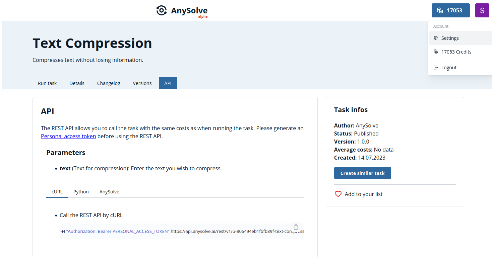
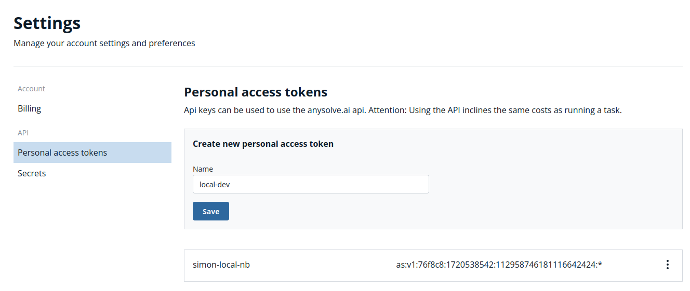
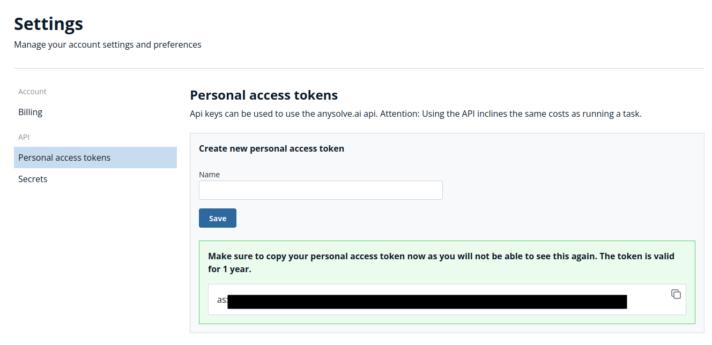
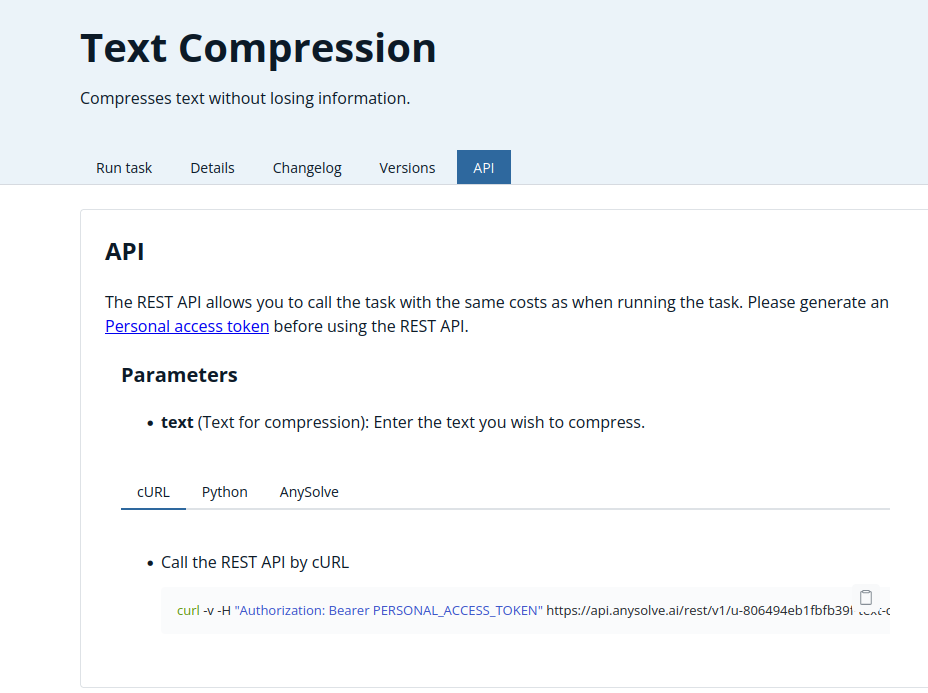

# REST API

Every task e.g. the [Text Compression](https://www.anysolve.ai/tasks/u-806494eb1fbfb39f-text-compression?version=1.0.0) task can be accessed by a REST
interface.

## Costs

The execution of tasks by the REST interface costs as much as when running a task [manually](https://www.anysolve.ai/pricing).

## Personal Access Token

Before using the REST API you need to create a personal access token. It allows to authenticate you as a User. Go into the settings by clicking on `Setting` on the menu in the top right of the page.

Next you go to the `Personal Access Tokens` tab and insert a name for the new access token `local-dev`.

After clicking on `Save` a token is created. Copy it as it won't appear anymore.

## Using the REST API

Every task e.g. the [Text Compression](https://www.anysolve.ai/tasks/u-806494eb1fbfb39f-text-compression?version=1.0.0) has a `API` section that shows you how to use the task.

You can:

- Use the REST API directly by a tool, e.g. cURL.
- Use the Python library [anysolve](https://github.com/BlackriverOrg/anysolve) to execute a task.
