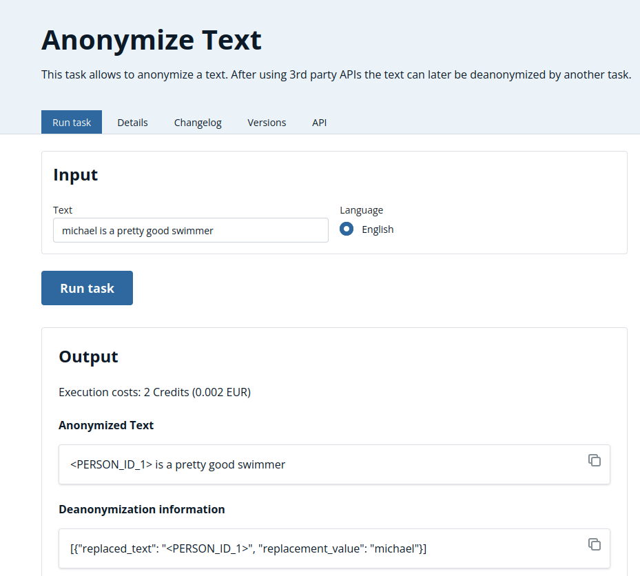

# Task design - Run AIs anonymized

As a Company or Private Person that is regulated by Privacy Laws as the GDPR you may worry about leaking your customer's data to AI models that are re-trained with the data you input.

AnySolve offers a solution for this problem. The [https://www.anysolve.ai/tools/intern-anonymizer-anonymize](Anonymize Text Task) allows you to use the [Software Presidio](https://microsoft.github.io/presidio/) to anonymize your inputs.

**Please note** that there is no guarantee that every form of private input is anonymized. Test it in full on your input data.

There are two scenarios you can use it.

## Introduction Video

{: poster='../anonymize-ai.jpg'}

## A) Simple input anonymization without sensitive information in the result

- You want to replace sensitive content in the input and process it with a task.
- You don't need the sensitive information in the result.

When designing a task add the anonymization task as subtask before using an input in a subtask that may send the data to a 3rd party. Typically this could be a ChatComplete task.

## B) Anonymization before processing and De-anonymization of the result

- You want to replace sensitive content in the input and process it with a task.
- You need the sensitive information in the result.

When designing a task add the anonymization task as subtask before using an input in a subtask that may send the data to a 3rd party. At the end of the task add a subtask that deanonymizes the result by using the `De-anonymization information` that is provided by the anonymization task.

## Conclusion

AnySolve provides a solution. Stay cautious how well the anonymization works for your input and test whether it always works.
