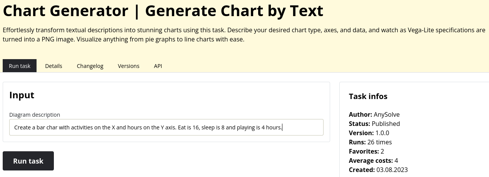
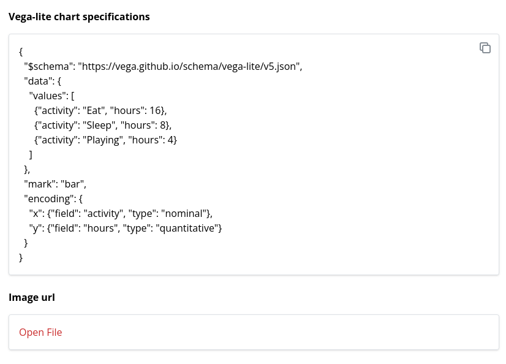
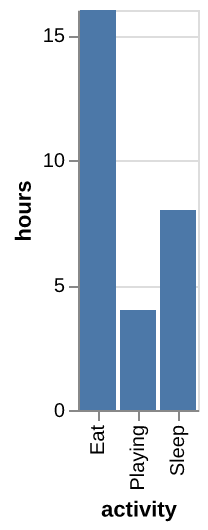

# Tool: Chart generator

Welcome to the world of effortless chart creation with the Chart Generator provided by AnySolve! This showcase highlights the innovative [Chart Generator | Generate Chart by Text](https://www.anysolve.ai/tools/intern-text-to-image-description-chart) tool that empowers you to transform textual descriptions into captivating visual representations.

**Note**: The remarkable capabilities of AnySolve have brought this tool to life. Moreover, you have the power to craft similar tools effortlessly using the intuitive tool designer.

## Introduction Video

To kick things off, watch our informative introduction video that provides an insightful overview of the Chart Generator's functionalities.

{: poster='../chart-generator.jpg'}

## Specify your tool

Engaging with the Chart Generator is a breeze. Start by conveying your chart creation needs to the AI. Simply specify the following components:

- **Chart Type**: Define the type of chart you want, whether it's a bar chart, line graph, scatter plot, and more.
- **Axes Configuration**: Outline the axes of your chart, detailing what data each axis should represent.
- **Data Points**: Provide the data points relevant to your chart. For instance, you can enter a description like: `Create a bar chart with activities on the X-axis and hours on the Y-axis. 'Eat' is 16 hours, 'sleep' is 8 hours, and 'playing' is 4 hours.`

Once you've detailed your requirements, just hit the `Run tool` button.

## Instant Results: Your Visual Chart and Specification

In the blink of an eye, the Chart Generator will process your input and produce remarkable results. You'll receive two essential outputs:

- **Vega-Lite Specification**: Delve into the heart of the chart's specifications with the generated Vega-Lite code snippet. This empowers users with technical insight and control.

- **Chart PNG Image**: Behold the beauty of your envisioned chart in the form of a high-quality PNG image. This image succinctly conveys the information you've provided, transforming it into an easily digestible visual representation.

## Conclusion

In conclusion, the Chart Generator revolutionizes the way you create visual charts. With just a few seconds of interaction, you can translate your textual descriptions into stunning visual assets. While precision in specifying chart type and axes is key, the process is swift and yields impressive results. Say goodbye to the complexities of traditional charting and embrace the efficiency and elegance of the Chart Generator by AnySolve.
