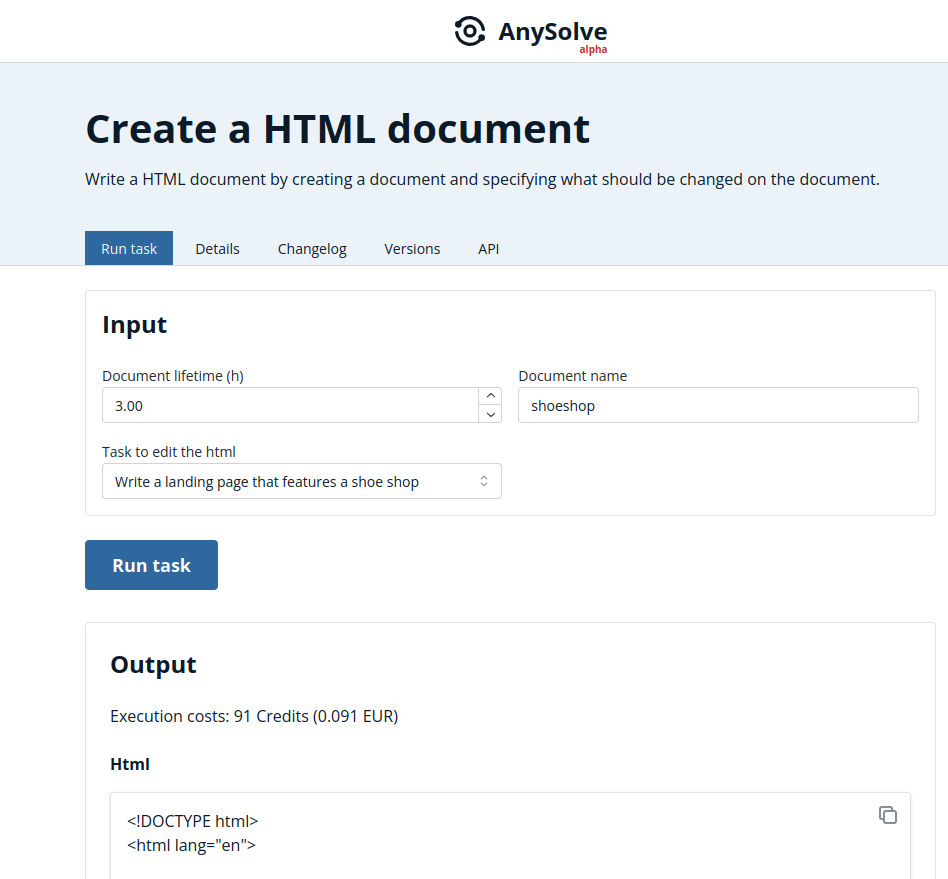
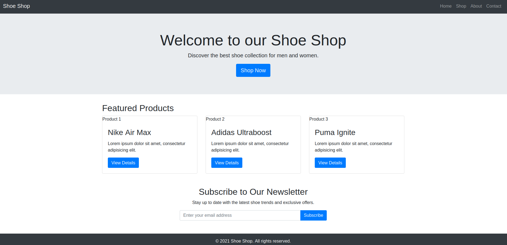
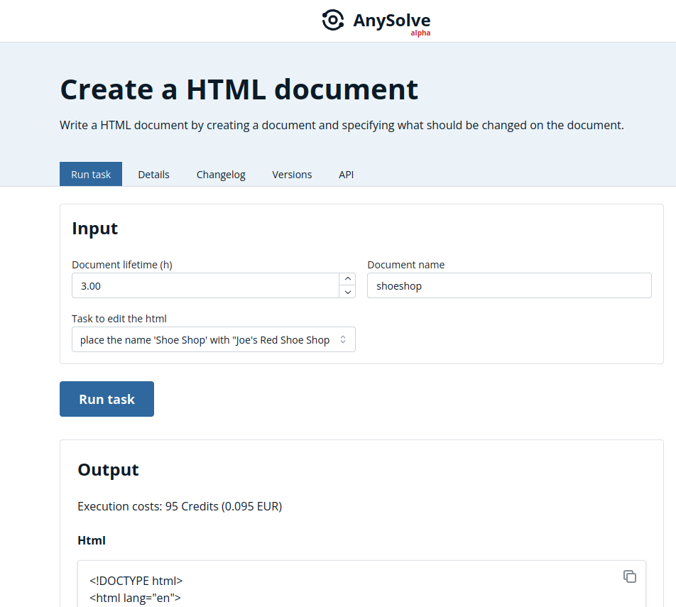
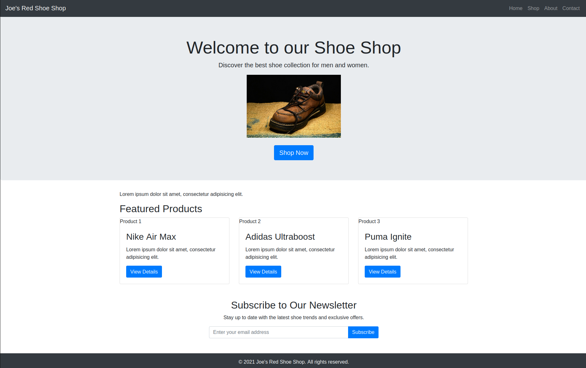

# Task: Create a HTML document

The following showcase presents the [Create a HTML document](https://www.anysolve.ai/tasks/u-ba835df8268fc301-create-a-html-document) task.

Please note that this task has been created by the capabilities of AnySolve. You can create a task that does a similar task easily with the task designer. Similar Tasks: [Create a Python script](https://www.anysolve.ai/tasks/u-ba835df8268fc301-create-a-python-script), [Write and further improve a newspaper article](https://www.anysolve.ai/tasks/u-ba835df8268fc301-write-and-further-improve-a-newspaper-article), [Write a paper](https://www.anysolve.ai/tasks/u-ba835df8268fc301-write-a-paper)

## Introduction Video

## First run

The task allows you to create a new html document named `shoeshop`.

You start with telling the AI to `Write a landing page that features a shoe shop` and click on `Run task`.

As a result you get the HTML code and a html file that can be shown in the browser:

## Add a logo

Next you want to add a logo. We found a free shoe image at pixabay.

You run the task again with `Add the image https://cdn.pixabay.com/photo/2014/01/22/19/38/boot-250012_960_720.jpg as a logo. Place the image under the welcome text and show it 300 x 200`

## Name the shop

The shop has a very generic name. You run the task again with `Replace the name 'Shoe Shop' with "Joe's Red Shoe Shop"`.

You and get the final result:

## Conclusion

The task allows you to create a HTML page and tell the AI to make changes if you are not yet satisfied with a resulting HTML page. You get the HTML code and a HTML file you can use.
