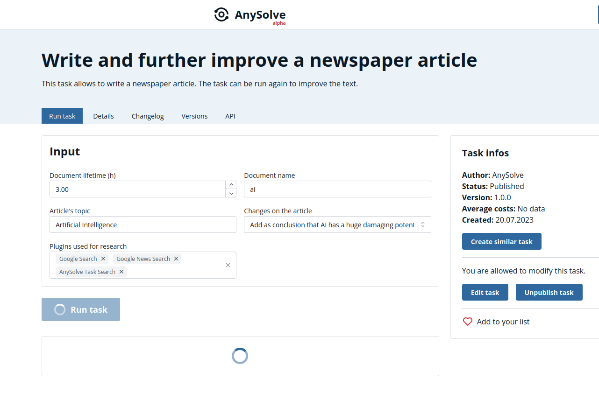

# Task: Write and further improve a newspaper article

The following showcase presents the [Write and further improve a newspaper article](https://www.anysolve.ai/tasks/u-ba835df8268fc301-write-and-further-improve-a-newspaper-article) task.

Please note that this task has been created by the capabilities of AnySolve. You can create a task that does a similar task easily with the task designer. Similar Tasks: [Create a Python script](https://www.anysolve.ai/tasks/u-ba835df8268fc301-create-a-python-script), [Write and further improve a newspaper article](https://www.anysolve.ai/tasks/u-ba835df8268fc301-write-and-further-improve-a-newspaper-article), [Write a paper](https://www.anysolve.ai/tasks/u-ba835df8268fc301-write-a-paper), [Create a HTML document](https://www.anysolve.ai/tasks/u-ba835df8268fc301-create-a-html-document)

## Introduction Video

## First run

The task allows you to create a new html document named `ai` and the topic `Artificial Intelligence`.

You start with telling the AI to `Write an article about the influence of artificial intelligence on the society` and click on `Run task`.

The resulting PDF file can be opened [here](basic.pdf).

## Adding examples

The result is a nice article about the influence of artificial intelligence on the society. However you want to add some examples.

You run the task again with `Add a positive and negative examples as continuous text for each sector`

The resulting PDF file can be opened [here](add-examples.pdf).

## The style is too clean

The style of the article feels a bit too clean. You run the task again with `Change the article to an opinion text with strong positions and opinions`.

The resulting PDF file can be opened [here](style.pdf).

## Add warnings about damaging effects

You want to add some concerns. You run the task again with `Add as conclusion that AI has a huge damaging potential`.

The resulting PDF file can be opened [here](final.pdf).

## Conclusion

The task allows you to write a newspaper article on a subject and tell the AI to make changes if you are not yet satisfied with a part of the article. You get text and different output files that are ready to use.
