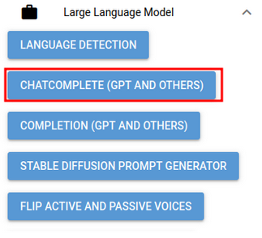
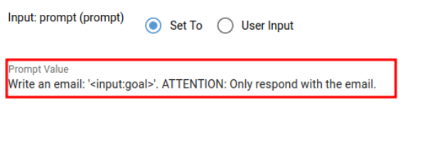
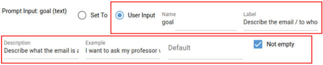
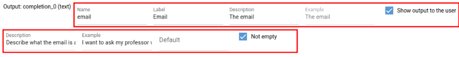

# Create your own AI tool

The following showcase how to create an AnySolve tool.

Imagine you want an AI tool that composes a work email for you. You describe what it should contain and ChatGPT should write it for you.

## Introduction Video

{: poster='../create-your-own-ai-tools.jpg'}

## Create the tool and describe it

You go to [editor.anysolve.ai](https://editor.anysolve.ai/) and describe your tool.

## Add a ChatComplete subtool

You ad a ChatComplete subtool. It allows to use ChatGPT.

## Set Prompt

Next you set the prompt in the subtool. It tells ChatGPT what to do and what inputs to use.

The prompt creates an new input ´goal´.

## Set inputs and outputs

- You have created an input with ´<input:goal>´ in your prompt
- You set the input to User Input
- You set the label, description an example and set it to `Not empty`

The ChatComplete subtool has an output ´completion_0´. You set the label, description, an example and set it to `Show output to the user`

## Run tool and publish it

You run the tool by clicking on the `Run tool` button to generate the output examples based on the input examples. Now you can create the tool published (can be used by other users) or unpublished.

## Result

There you have it, your [first tool](https://www.anysolve.ai/tools/u-ba835df8268fc301-write-email).

## Conclusion

The tool editor allows you to create tools. The provided example only covers a simple example how you can create a tool with a ChatComplete prompt. You can create much more powerful tools.
