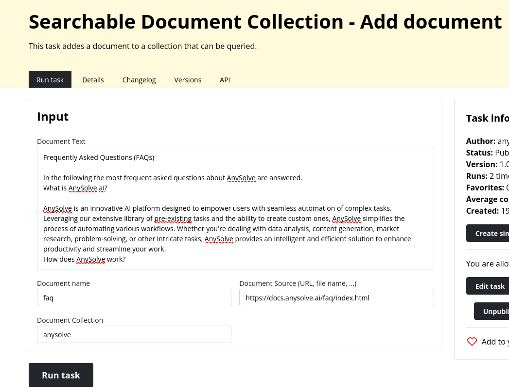
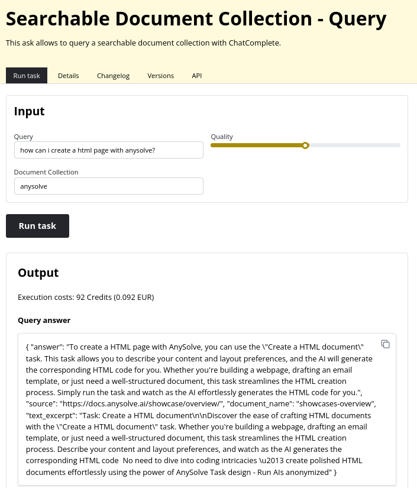

# Task: Query Document Collection

The following showcase presents the [Searchable Document Collection - Query](https://www.anysolve.ai/tasks/intern-memory-search-collection-query) and [Searchable Document Collection - Add document](https://www.anysolve.ai/tasks/intern-memory-search-collection-add-document) task. The tasks allows you to add documents to a collection and a user can ask questions about this documents.

Please note that this task has been created by the capabilities of AnySolve. You can create a task that does a similar task easily with the task designer. Similar Tasks: [Create a Python script](https://www.anysolve.ai/tasks/u-ba835df8268fc301-create-a-python-script), [Write and further improve a newspaper article](https://www.anysolve.ai/tasks/u-ba835df8268fc301-write-and-further-improve-a-newspaper-article), [Write a paper](https://www.anysolve.ai/tasks/u-ba835df8268fc301-write-a-paper), [Create a HTML document](https://www.anysolve.ai/tasks/u-ba835df8268fc301-create-a-html-document)

## Introduction Video

{: poster='../query-knowledge-base.jpg'}

## Adding the document collection

First we need to build our knowledge base. For this we need to upload documents. In this example we add information pages about AnySolve so that we can later ask questions about AnySolve. The FAQ page of AnySolve `https://docs.anysolve.ai/faq/` is added as `faq` in the collection name `anysolve`. The `collection name` is important as all documents that should be queried together need to have the same `collection name`.

Afterwards we add some more documents from the AnySolve website that have information about how to use AnySolve.

**Please note:** The document lifetime is specified in the task description.

## Querying the document collection

Now that we have a document collection we can query the knowledge base we have built. We can ask `how can i create a html page with anysolve`. The document collection parameter must be set to the collection which we named `anysolve`. We can also set the quality paramter which decides how well the quality of the task is. The lower the quality the cheaper the task run and the faster the result.

After a click on `Run task` we get the result.

The result shows the result as JSON format with `answer`, `source`, `document_name` and `text_excerpt`.

## Conclusion

The task allows you to add a document collection and queries the collection while getting a meaningful response.
