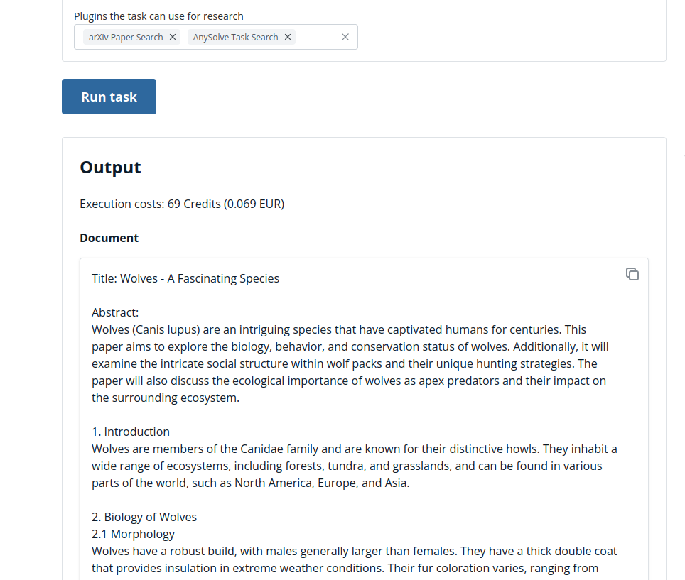

# Tool: Write a paper

The following showcase presents the [Write a paper](https://www.anysolve.ai/tools/u-ba835df8268fc301-write-a-paper) tool.

Please note that this tool has been created by the capabilities of AnySolve. You can create a tool that does a similar tool easily with the tool designer. Similar Tools: [Create a Python script](https://www.anysolve.ai/tools/u-ba835df8268fc301-create-a-python-script), [Write and further improve a newspaper article](https://www.anysolve.ai/tools/u-ba835df8268fc301-write-and-further-improve-a-newspaper-article), [Create a HTML Document](https://www.anysolve.ai/tools/u-ba835df8268fc301-create-a-html-document)

## First run

The tool allows you to create a new document named `wolve` and specify that it's in the field of `Biology`.

You start with telling the AI to `Start with writing a paper about wolves` and click on `Run tool`.


The results is the text of the paper.

```
Document: 'Start with writing a paper about wolves.'

Title: Wolves: The Apex Predators of the Wilderness

Abstract:
Wolves (Canis lupus) are charismatic and powerful animals that play a crucial role in maintaining the ecological balance of their habitats. This paper aims to explore the biology, behavior, and conservation status of wolves, shedding light on their importance as apex predators in the wilderness.

Introduction:
Wolves have long captured the fascination and curiosity of humans. Known for their intelligence, social structure, and hunting prowess, these canids have been the subject of numerous studies and research projects. In this paper, we delve into the world of wolves to gain a deeper understanding of their ecology, behavior, and conservation challenges.

1. Biology of Wolves
1.1 Taxonomy and Classification
1.2 Morphology and Adaptations
1.3 Reproduction and Life Cycle

2. Behavior of Wolves
2.1 Pack Structure and Social Organization
2.2 Hunting Strategies
2.3 Communication and Vocalizations

3. Ecological Significance
3.1 Keystone Species
3.2 Effects on Prey Populations
3.3 Trophic Cascades and Ecosystem Dynamics

4. Human-Wolf Interaction
4.1 Historical Perspective
4.2 Conservation Efforts and Challenges
4.3 Coexistence with Humans

5. Conclusion
In conclusion, this paper highlights the importance of wolves as apex predators in maintaining the ecological balance of their ecosystems. Understanding their biology, behavior, and ecological significance is crucial for their conservation and for promoting harmonious coexistence between humans and wolves.

References:
[List of relevant references]

---

Please note that this is just an outline and a starting point for your paper. You can expand on each section by incorporating information from research articles, scientific papers, and other credible sources.
```

Paper is also returned as PDF, DOCX, TEX, and TXT file.



The resulting PDF file can be opened [here](write-a-paper.pdf).

## Improve the paper by finishing the chapters

Next you want it to finish the chapters. You select `Finish all chapters` in `Changes on the paper` and run `Run tool` again.

The improved PDF file can be opened [here](write-a-paper-extended.pdf).

## Add references

You are not yet satisfied with the paper. The AI did a good job but you want to add some improvements. Let's add some references. You select `Search for References` and let the `arXiv Paper Search` activated and run the tool again on the same document.

Now you get a new version with added documents.

## Conclusion

The tool allows you to write a paper on a subject and tell the AI to make changes if you are not yet satisfied with a part of the paper. You get text and different output files that are ready to use.
